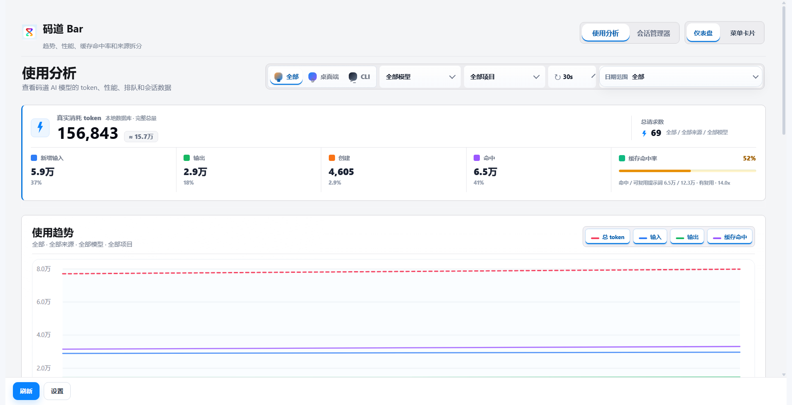
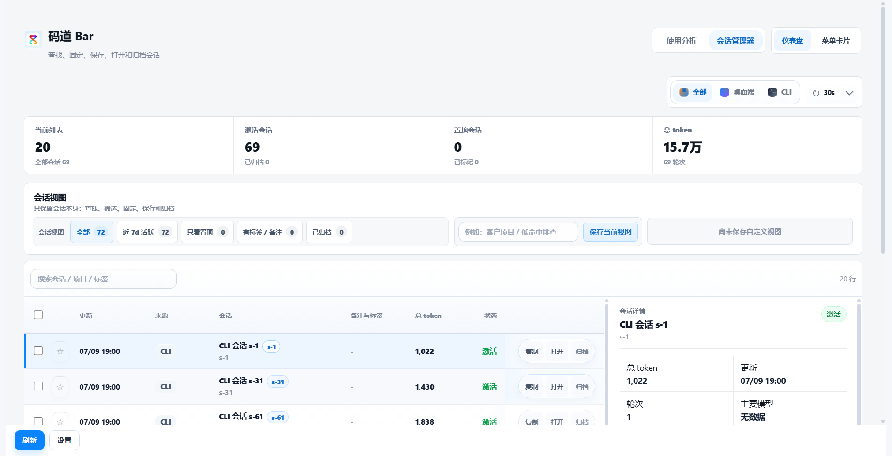
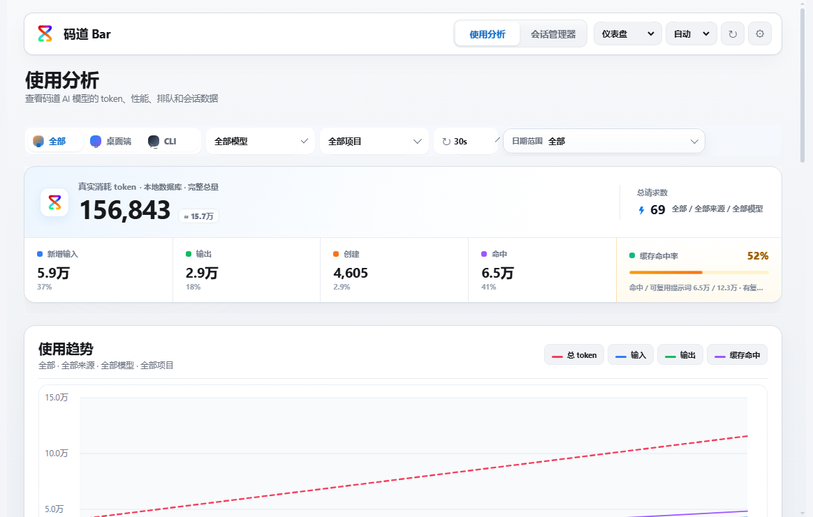
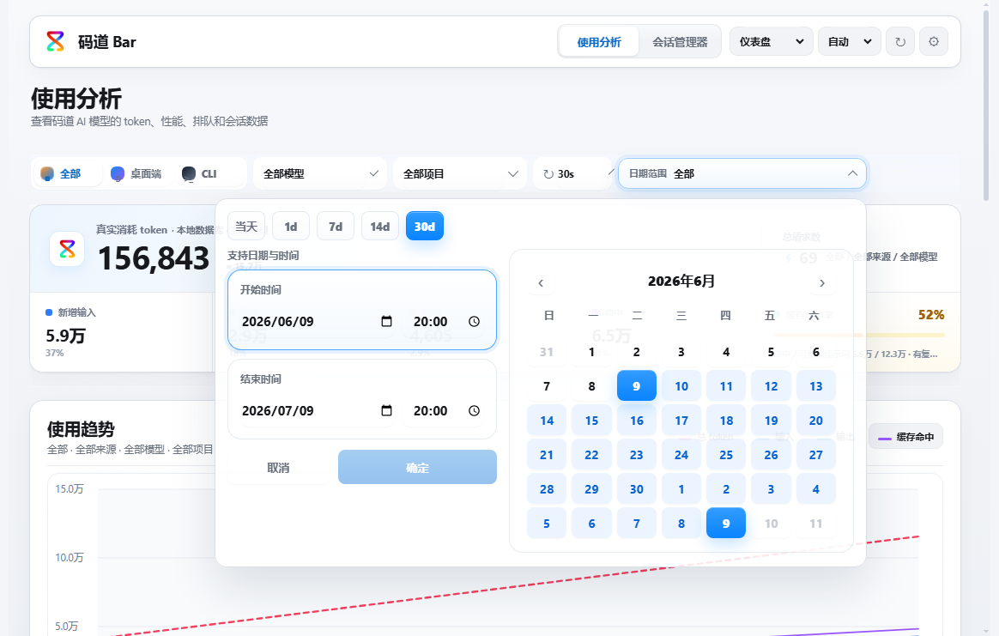
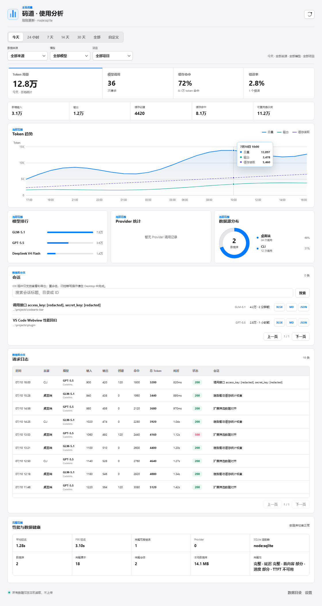
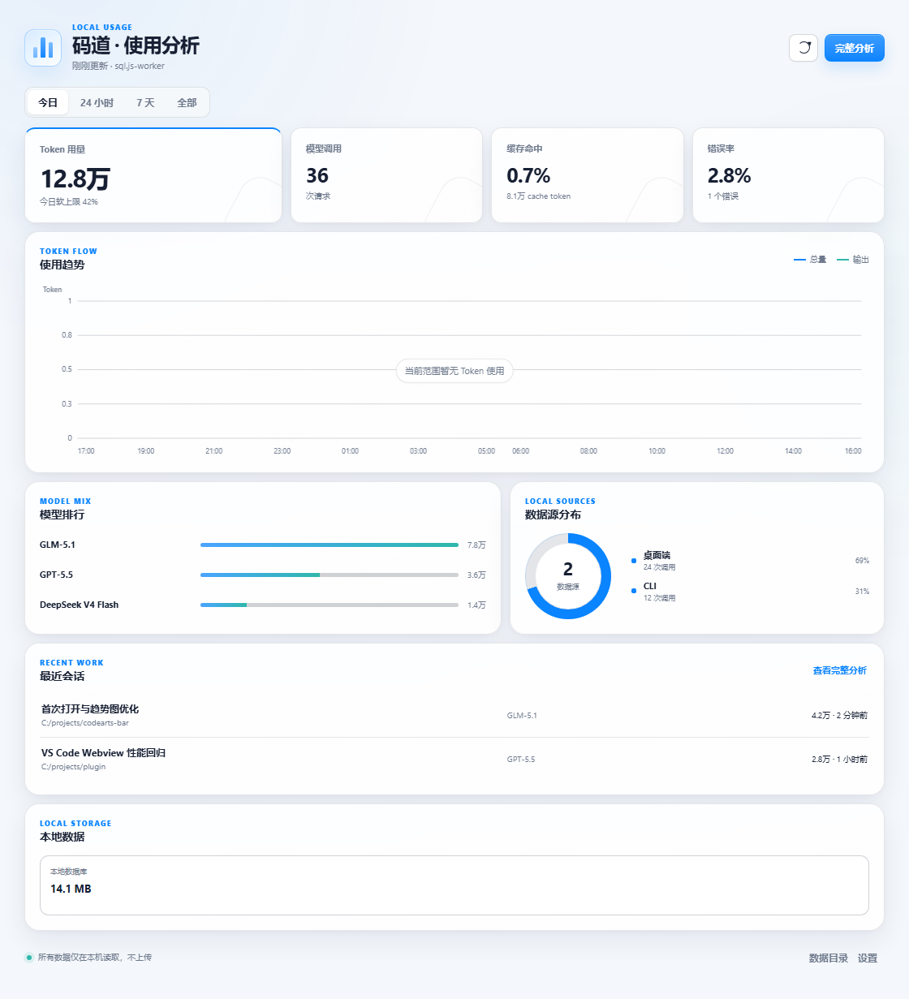
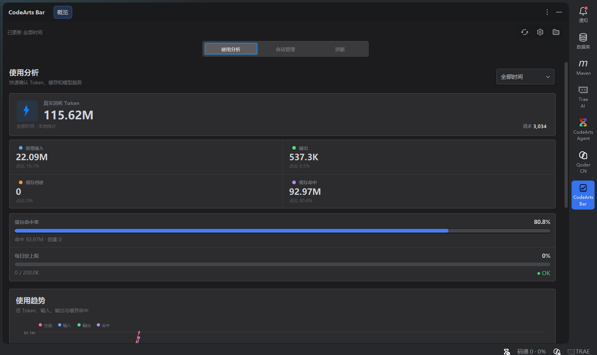
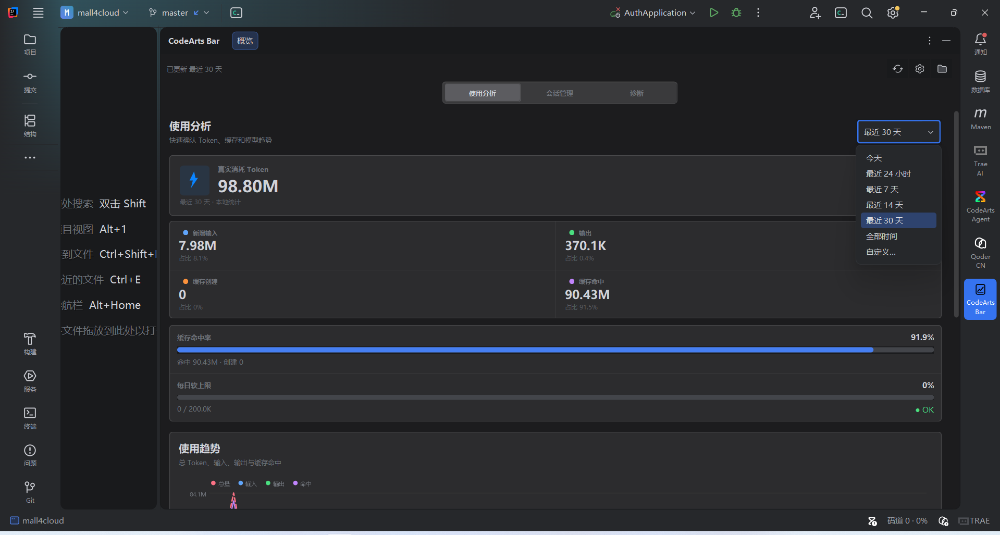
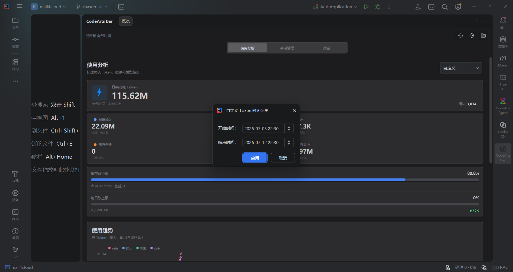
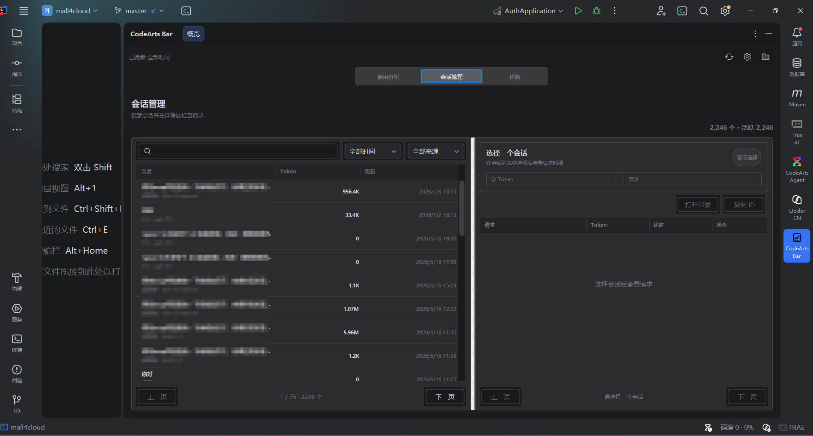

# CodeArts Bar

> 本地优先的 CodeArts Agent 用量分析与会话工作台。

CodeArts Bar 在本机读取 CodeArts Agent 生成的 SQLite 数据，提供 **Windows 桌面端、VS Code / CodeArts 扩展、JetBrains 插件和 CLI**。它用于查看 token 用量、缓存命中、模型与来源趋势、性能指标和最近会话；原始数据库、日志和 prompt 不会上传。

当前版本：**1.16.30**。

[下载 Windows 版本](https://gitee.com/dtse01/codearts-bar/releases) · [安装 VS Code 扩展](#vs-code--codearts-扩展) · [使用 CLI](#cli) · [从源码运行](#从源码运行)



## 选择适合你的入口

| 入口 | 适合场景 | 提供内容 |
| --- | --- | --- |
| **Windows Desktop** | 完整分析和会话管理 | 托盘应用、使用分析、日期/来源/模型筛选、诊断中心、会话固定/重命名/归档 |
| **VS Code / CodeArts 扩展** | 编码时快速查看 | 活动栏概览、趋势、模型排行、来源分布、最近会话、Hover Tooltip 和空数据状态 |
| **JetBrains 插件** | 在 IDEA、PyCharm、WebStorm、GoLand 中查看 | 使用分析 / 会话管理 / 诊断三项主导航、数据库分页会话与请求、脱敏诊断 |
| **CLI / npm 包** | 终端、脚本和诊断 | 文本统计、JSON 快照、运行时检查、数据源诊断和配置 |

## 主要能力

- **使用分析**：总 token、输入、输出、缓存创建/命中、缓存命中率、请求数和时间趋势。
- **双数据源**：自动发现桌面端与 CLI 数据库，可合并查看，也可单独筛选。
- **模型与性能**：模型排行、等待时间、P95/P99、首内容时间、输出速度和错误率。
- **会话管理**：搜索、筛选、固定、重命名、复制摘要、打开目录、归档和恢复。
- **真实数据库分页**：请求、会话和详情按需读取，不把全部记录一次性塞进界面。
- **本地诊断**：检查数据库路径、SQLite adapter、缓存、日志和上次异常退出状态。
- **平滑冷启动**：先显示 Summary Skeleton 和核心指标，再在后台补趋势、模型及会话聚合。

## 界面预览

| 使用分析 | 会话管理 |
| --- | --- |
|  |  |

| 普通窗口 | 日期范围 |
| --- | --- |
|  |  |

| VS Code 趋势 Tooltip | 全零数据空态 |
| --- | --- |
|  |  |

| JetBrains 使用分析 | JetBrains Token 时间筛选 |
| --- | --- |
|  |  |

| JetBrains 自定义时间范围 | JetBrains 会话管理 |
| --- | --- |
|  |  |

更多回归截图：[`docs/screenshots`](docs/screenshots)。

## 安装

### Windows 安装版与便携版

打开 [Gitee Releases](https://gitee.com/dtse01/codearts-bar/releases)，按需要下载：

- `CodeArts-Bar-Setup-<version>-x64.exe`：带安装向导、开始菜单与卸载入口。
- `CodeArts-Bar-Portable-<version>-x64.exe`：免安装，适合 U 盘或临时使用。

首次运行后应用会驻留托盘，默认打开“使用分析”。如果 Windows 显示未知发布者提示，请先核对 Release 中的 `SHA256SUMS.txt`，确认文件来自本仓库且校验值一致。

> 当前桌面发布目标为 Windows x64。macOS / Linux 尚未提供经过实机验证的安装包。

### VS Code / CodeArts 扩展

1. 从 Release 下载 `codearts-bar-status.vsix`。
2. 在 VS Code / CodeArts 中打开“扩展”。
3. 选择右上角 `...` → **从 VSIX 安装...**。
4. 安装后点击活动栏中的“码道”，或在命令面板执行 `码道：打开概览侧边栏`。

扩展默认读取桌面端数据库。自定义路径可在设置中填写：

```text
codeartsBar.dbPath
```

扩展保持轻量：它先加载 Summary，面板可见后再补齐趋势、模型和会话聚合；完整会话管理仍由桌面端承担。

### JetBrains 插件

1. 从 Release 下载 `codearts-bar-jetbrains-<version>.zip`。
2. 在 IntelliJ IDEA、PyCharm、WebStorm 或 GoLand 中打开 **Settings | Plugins**。
3. 点击齿轮菜单，选择 **Install Plugin from Disk...**，然后选择下载的 ZIP。
4. 安装并重启 IDE 后，打开右侧 **CodeArts Bar** 工具窗口。

插件工具窗口使用 **使用分析 / 会话管理 / 诊断** 三项主导航。使用分析包含 Token、缓存、软上限、趋势和模型/来源视图；会话管理支持搜索、来源筛选、数据库分页，以及从会话列表进入请求列表和请求明细；诊断页支持重试、打开设置或数据目录，并复制脱敏报告。

安装和使用插件**不需要单独安装 JDK**，它运行在 JetBrains IDE 自带的 Java Runtime 上。插件内置共享 CLI 资源，但读取本地数据仍需要系统可执行的 Node.js 18 或更高版本；自动发现失败时，可在 **Settings | Tools | CodeArts Bar** 中配置 Node.js、CLI 或 `opencode.db` 路径。会话搜索和分页直接查询本地数据库，不受概览快照条数限制。只有从源码构建 JetBrains 插件时才需要 JDK 21。

### CLI

Release 提供两种压缩包：

- `codearts-bar-cli.zip`：体积较小，需要系统已安装 Node.js 18 或更高版本。
- `codearts-bar-cli-standalone.zip`：内置 Node.js，Windows 上解压即可运行。

也可以安装 npm 包：

```powershell
npm install -g codearts-bar
codearts-bar stats
```

常用命令：

```powershell
codearts-bar stats                 # 文本统计
codearts-bar snapshot              # JSON 快照
codearts-bar runtime               # Node / SQLite 运行时
codearts-bar diagnose              # 数据源、日志和缓存诊断
codearts-bar config show           # 查看配置与配置文件位置
codearts-bar config set --db "D:\path\to\opencode.db"
codearts-bar self-test             # 验证当前机器的真实数据读取
```

未全局安装时，可在源码目录使用 `node src/cli.js <command>`。

### 从源码运行

要求：

- Node.js 22 或 24
- npm
- Windows 10/11（构建 Windows 安装包时）

```powershell
git clone https://gitee.com/dtse01/codearts-bar.git
cd codearts-bar
npm ci
npm start
```

开发模式：

```powershell
npm run dev
```

## 数据源

默认自动发现两个只读数据源：

| 显示名称 | 默认路径 | 产生者 |
| --- | --- | --- |
| 桌面端 | `~/.codeartsdoer/codearts-data/opencode.db` | CodeArts Agent 桌面应用 |
| CLI | `~/.codeartsdoer/cli-data/opencode.db` | CodeArts Agent CLI |

两类数据可以合并统计，也可以在 Dashboard 中单独选择。需要覆盖默认路径时，可以使用：

- 桌面端设置中的数据库路径。
- VS Code 设置 `codeartsBar.dbPath`。
- CLI：`codearts-bar config set --db <path>`。
- 环境变量：`CODEARTS_BAR_DB=<path>`。

运行 `codearts-bar diagnose` 可以检查实际发现的数据源、文件可读性与 SQLite adapter。

## 统计口径

CodeArts Bar 不估算或反向推测 token。它读取本地 `opencode.db` 中 assistant 消息及其 `step-finish` part 的 `tokens` / `usage` 字段；同一条消息有 `step-finish` 明细时优先汇总明细，否则使用消息自身的 usage。字段名同时兼容常见的 camelCase、snake_case 和 OpenAI 风格命名。

| 指标 | 统计方式 |
| --- | --- |
| **输入 token** | 请求中未由缓存复用的新输入，读取 `input`、`inputTokens`、`prompt_tokens` 等字段。 |
| **输出 token** | 模型生成内容，读取 `output`、`outputTokens`、`completion_tokens` 等字段。 |
| **推理 token** | 数据源单独提供 reasoning 时独立累计；它计入总 token，但当前主面板不单独占一张卡。 |
| **缓存创建** | 为后续请求写入缓存的提示词 token，读取 `cache.write`、`cacheWrite`、`cache_creation_input_tokens` 等字段。 |
| **缓存命中** | 本次请求直接从缓存复用的提示词 token，读取 `cache.read`、`cacheRead`、`cached_tokens` 等字段。 |
| **总 token** | 优先使用数据源给出的 `total`；没有 total 时按 `输入 + 输出 + 推理 + 缓存创建 + 缓存命中` 计算。它表示记录中的完整 token 用量，不等同于“输入 + 输出”。 |
| **请求数** | 每条 assistant 模型响应计为一次请求；用户消息不计入请求数。 |
| **会话数** | 按数据源和 session ID 去重。桌面端与 CLI 即使 ID 相同也视为不同来源的会话。 |
| **错误数 / 错误率** | assistant 响应含 error 时记一次错误；错误率为 `错误请求数 / 请求数`。 |

缓存命中率采用提示词复用口径：

```text
缓存命中率 = 缓存命中 token / (新增输入 token + 缓存命中 token) x 100%
```

分母只统计本次请求可复用的提示词输入，不包含输出、推理和缓存创建。因此它反映“输入上下文中有多少直接来自缓存”，不是 `缓存命中 / 总 token`。当分母为 0 时显示无数据，而不是 0%。

时间、来源和模型筛选会共同限定统计范围：当天按本机时区的 00:00 开始；`1d` 至 `365d` 是相对当前时间的滚动窗口；自定义范围精确到开始和结束时间；“全部”不设开始时间。区间采用请求时间筛选，并同步重算总量、请求、缓存、趋势、模型与来源数据。趋势按本机时区分桶，短区间通常按小时，长区间按天；没有请求的桶补 0，避免折线跨过空闲时段。

性能指标只使用存在相应时间记录的请求，所以样本数可能小于请求数：

- **总等待 / 延迟**：assistant 响应创建到完成的时间；P50、P95、P99 从有效样本排序后取对应百分位。
- **TTFT**：优先来自 CodeArts kernel 日志中的首 token 事件；没有日志事件时不伪造数值。
- **等待首内容**：assistant 消息创建到第一个非 `step-start` / `step-finish` 内容 part 的时间，是本地记录推导的近似值。
- **输出速度**：`输出 token / 完成耗时（秒）`，只统计完成时间有效且大于 0 的请求。
- **排队时间**：来自本地队列事件；没有队列事件时显示无数据。

数据库可能在对话结束后才写入完整 usage，因此正在生成的回复不会按字符实时估算；写入完成并刷新后才进入统计。双数据源合并时各来源先独立聚合，再按相同口径求和，读取失败的来源会在诊断中单独标记，不会用 0 静默替代。

## 隐私与本地数据

- 数据库和日志仅从本机文件系统读取。
- Dashboard、托盘、VS Code Webview 与 CLI 的聚合均在本地完成。
- 应用不会上传原始数据库、会话、日志、prompt 或本地统计结果。
- 默认以只读方式打开数据库；会话重命名、固定和归档仅在用户主动操作时写回对应本地数据库。
- 缓存和设置存放在本机 `CodeArtsBar` 配置目录，可通过 `codearts-bar config show` 查看实际位置。
- 诊断信息会对路径做脱敏。提交 Issue 时仍不要附加原始 `opencode.db` 或包含 prompt 的日志。

## 首次打开、缓存与刷新

首次打开时不会等待全部聚合完成：

1. 立即展示 Summary Skeleton。
2. 核心 token 与缓存指标先显示。
3. 趋势、模型、来源和会话统计在后台补齐。
4. `sql.js + wasm` 冷路径超过 300ms 时显示“正在建立缓存...”。

数据库监听覆盖主数据库、WAL、SHM、touch 文件与相关目录。Dashboard 可见时默认每 4 秒兜底检查，隐藏到托盘后降为 15 秒，以减少后台占用。

## 已知限制

- 大型数据库第一次聚合可能较慢，缓存建立后会明显加快。
- 优先使用 `node:sqlite`；运行环境不支持时自动回退到 `sql.js + wasm`，功能保持可用，但冷启动成本更高。
- 极大的历史数据库可能需要等待后台 rollup / sidecar 缓存完成。
- 数据准确性取决于本地数据库结构以及 CodeArts Agent 已写入记录的完整性。
- 当前正式桌面产物为 Windows x64；macOS / Linux 需要额外实机回归与打包适配。
- VS Code 扩展定位为轻量概览，不包含桌面端全部会话管理能力。

## 开发与验证

```powershell
npm test                     # 单元、Smoke、跨平台 CLI 和流水线契约测试
npm run verify               # 完整本地验证，包含 Electron 与 VS Code E2E
npm run verify:ci            # Windows CI：验证、压力测试和视觉回归
npm run test:visual          # 七场景像素回归
npm run build:extension      # 生成 release/codearts-bar-status.vsix
npm run build:jetbrains      # 生成 JetBrains 插件 ZIP（需要 JDK 21）
npm run build:app            # 生成 Windows 安装版与便携版
npm run pack:npm             # 生成精简 npm 包
```

Gitee Go 在分支、PR 和 `master` 上使用 Node.js 22 执行可跨平台的测试、压力测试、VSIX 与 npm 包构建。Windows 安装包由 Windows CI 构建并执行 ASAR/资源校验。

更新 README 截图：

```powershell
npm run update:readme-screenshots
```

## 项目结构

```text
src/                 Electron、CLI、聚合与共享业务源码
extension/           VS Code / CodeArts 扩展运行时和 Webview
jetbrains-plugin/    IntelliJ Platform 插件、工具窗口和状态栏组件
tests/               单测、E2E、压力测试与视觉回归
.workflow/           Gitee Go 流水线
.github/workflows/   Windows CI
docs/screenshots/    README 与视觉回归截图
```

## License

[MIT](LICENSE)
