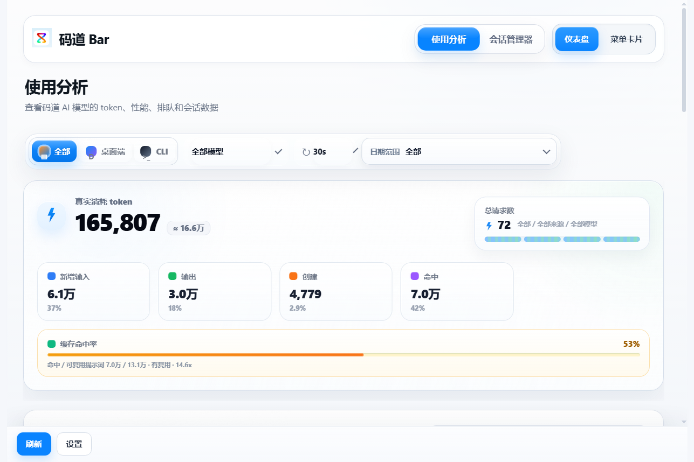

# CodeArts Bar

CodeArts Bar 是一个面向 CodeArts Agent 用户的**本地用量与会话工作台**。它提供 Electron 桌面托盘应用、使用分析 Dashboard、会话管理、CLI 和 VS Code / CodeArts 扩展。

> 隐私优先：所有统计均在本机读取和计算，不上传数据库、日志或 prompt 内容。


## 功能

- **使用分析**：总 token、输入 / 输出、缓存创建与命中、缓存命中率、趋势和模型统计。
- **桌面端 / CLI 分源统计**：可查看全部数据，也可单独筛选桌面端或 CLI。
- **会话管理**：搜索、筛选、固定、重命名、打开目录、复制摘要、归档和恢复。
- **真实数据库分页**：请求日志、会话列表和会话详情按需从本地数据库读取。
- **桌面托盘、CLI 与本地诊断**：查看用量、SQLite 运行时、数据库健康和缓存状态。

## 截图

| 使用分析（宽屏） | 会话管理 |
| --- | --- |
|  |  |

| 窄屏窗口 | 日期选择器 |
| --- | --- |
|  |  |

## 安装

### Windows 安装包或便携版

从 Release 下载：

- `CodeArts-Bar-Setup-<version>-x64.exe`：安装版。
- `CodeArts-Bar-Portable-<version>-x64.exe`：免安装便携版。

安装后可从开始菜单或桌面快捷方式启动。发布包同时提供 `codearts-bar.cmd` 和 `codearts-bar.ps1` CLI 启动器。

### 从源码运行

```powershell
git clone <repository-url>
cd codearts-bar
npm install
npm start
```

开发模式：`npm run dev`。

### CLI

```powershell
node src/cli.js stats
node src/cli.js snapshot
node src/cli.js runtime
node src/cli.js diagnose
```

通过 npm 安装或发布包启动器运行时，也可执行 `codearts-bar stats`、`codearts-bar diagnose`。

## 数据源

CodeArts Bar 自动发现 CodeArts Agent 在本机生成的 SQLite 数据库，并区分两个入口：

- **桌面端数据源**：来自 CodeArts Agent 桌面应用产生的本地 `opencode.db`，Dashboard 中显示为“桌面端”。
- **CLI 数据源**：来自 CodeArts Agent CLI 产生的本地 `opencode.db`，Dashboard 中显示为“CLI”。

两类数据可合并查看，也可单独筛选。若数据库不在默认位置，可在设置中指定路径；运行 `codearts-bar diagnose` 可检查数据源和 SQLite adapter。

## 隐私

- 所有数据均从本机数据库和本地日志读取。
- Dashboard、托盘和 CLI 的聚合计算均在本地完成。
- 不上传原始数据库、会话、日志、prompt 或统计结果。
- 诊断报告会对路径做脱敏，仅保留文件名、hash、存在性、可读性、adapter、缓存状态和错误码。
- 提交 issue 时不要上传原始 `opencode.db` 或包含 prompt 的日志。

## 首次打开与缓存

1. 立即显示 summary skeleton，避免空白首屏。
2. summary 就绪后先展示核心 token 与缓存指标。
3. 趋势、模型统计、来源统计和会话汇总在后台补齐。
4. 使用 `sql.js + wasm` 且冷路径超过 300ms 时，会提示“正在建立缓存...”。

## 已知限制

- 第一次聚合较大的数据库时可能较慢，缓存建立后会明显加快。
- 优先使用 `node:sqlite`；不支持时自动回退到 `sql.js + wasm`，功能可用但冷启动成本更高。
- 当前主要针对 Windows 桌面窗口验证；macOS / Linux 发布前仍需对应平台实机回归。
- 极大的数据库仍可能需要等待后台 rollup / sidecar 缓存完成。
- 统计结果取决于本地数据库结构和 CodeArts Agent 已写入的数据完整性。

## 开发与验证

```powershell
npm test
npm run e2e:electron
npm run stress:dashboard
npm run stress:pagination
npm run stress:aggregation
```

生成预览截图：`npm run screenshot:dashboard`
构建 Windows 安装包和便携版：`npm run build:app`

## VS Code / CodeArts visual regression

The extension loads the lightweight Summary first and fills trend, model and session aggregates only after the Webview becomes visible. The chart keeps its axes when every value is zero. Hovering the trend shows time, total tokens and output tokens.

| Hover tooltip | Zero-data state |
| --- | --- |
|  |  |

## Adaptive local refresh

Database file watching covers the main database, WAL, SHM, touch file and related directories. The fallback poll interval defaults to 4000 ms while the dashboard is visible and 15000 ms while hidden in the tray. These values are configurable in Settings or with `CODEARTS_BAR_DB_WATCH_VISIBLE_POLL_MS` and `CODEARTS_BAR_DB_WATCH_HIDDEN_POLL_MS`.

The Settings module keeps an in-memory normalized snapshot and watches `settings.json` for external changes, avoiding repeated synchronous parsing on refresh hot paths.

## Additional verification

```powershell
npm run e2e:vscode
npm run screenshot:vscode
```

The Extension Host test launches the official VS Code test runtime and measures real extension activation and refresh-command latency.

## License
MIT
